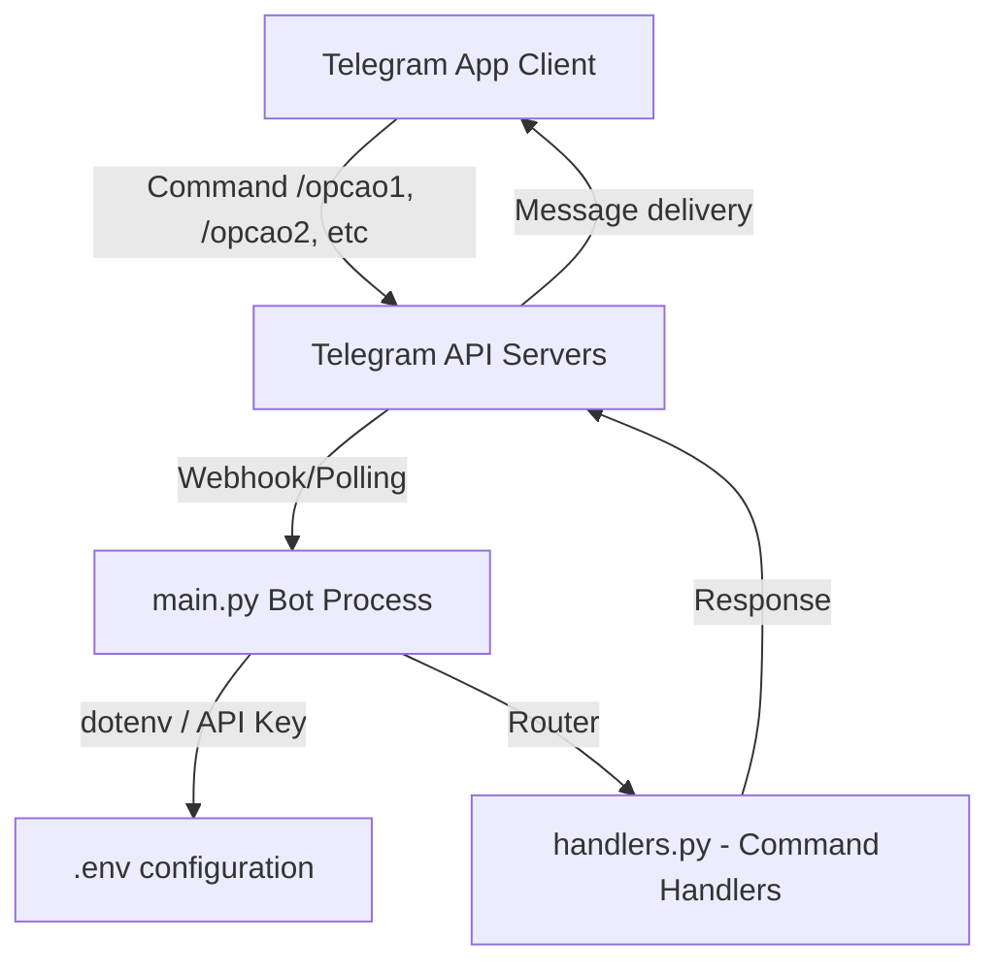

# Telegram Bot Lab

[](https://www.python.org/)
[](https://telegram.org/)

## Table of Contents

- [Context](#-context)
- [Software features](#-software-features)
- [Technologies and tools](#-technologies-and-tools)
- [Architecture](#-architecture)
- [Repository structure](#-repository-structure)
- [Requirements](#-requirements)
- [How to run](#-how-to-run)
- [Author](#-author)

# 📌 Context 

This project is a Telegram bot developed for learning and rapid bot prototyping using the `pyTelegramBotAPI` (telebot) library in Python. It features a modular structure splitting the entry point, command handlers, and utilities.

## 🚀 Software features

- **Modular Design:** Command handlers, utilities, and configuration are separated from the main executable script.
- **Interactive Commands:** Responds to custom options `/opcao1`, `/opcao2`, `/opcao3`, and `/opcao4`.
- **Default Responder:** Greets users with a custom message if they type any text that is not a registered command.
- **Security:** Relies on environment variables to keep the API key private.

## 🛠️ Technologies and tools

- Python 3.10
- PyTelegramBotAPI (telebot library wrapper)
- Python-dotenv (Environment variables manager)
- Anaconda / Conda (Environment package management)

## 📋 Architecture



## 📂 Repository structure

```text
- 📂 lab-bot-telegram/
  - 📄 .env.sample (Template configuration file)
  - 📄 environment.yml (Conda environment dependency definition)
  - 📄 main.py (Main bot client application)
  - 📄 handlers.py (Telegram commands and message handlers)
  - 📄 utils.py (Utility functions for custom messages)
```

## 📦 Requirements

- Python 3.10+ or Anaconda / Miniconda installed
- Telegram account and a bot created via BotFather (to obtain the bot token)

## ⚙️ How to run

### 1. Clone the Repository
Clone the repository to your local machine:
```bash
git clone https://github.com/MatheusRodri/lab-bot-telegram.git
cd lab-bot-telegram
```

### 2. Conda Environment Setup
Create and activate the environment containing all requirements from the `environment.yml` configuration:
```bash
conda env create -f environment.yml
conda activate bot_telegram
```
*(Alternatively, if not using Conda, create a standard virtual env and install `pip install pyTelegramBotAPI python-dotenv`).*

### 3. Configure Credentials
1. Rename the `.env.sample` file to `.env`:
   ```bash
   mv .env.sample .env
   ```
2. Open the `.env` file and replace the placeholder value with your actual Telegram Bot Token:
   ```text
   CHAVE_BOT=your_token_here
   ```

### 4. Run the Bot
Start the application:
```bash
python main.py
```
Open Telegram, search for your bot username, start a conversation, and test the `/opcao1` to `/opcao4` commands.

## 👤 Author

Matheus Rodrigues 
[LinkedIn](https://linkedin.com/in/matheus-rodrigues-mrj) [GitHub](https://github.com/MatheusRodri)